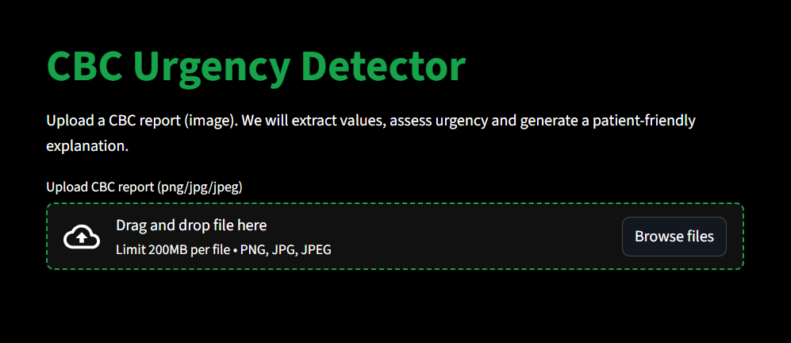
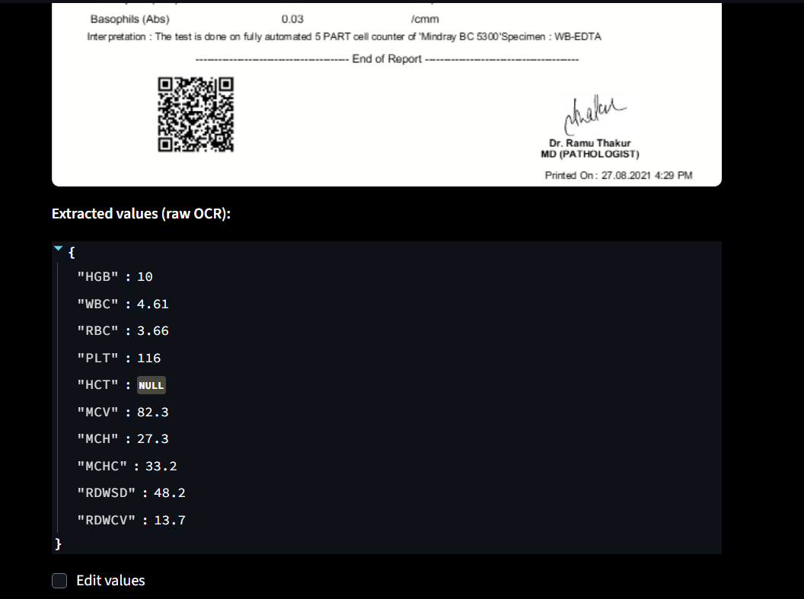
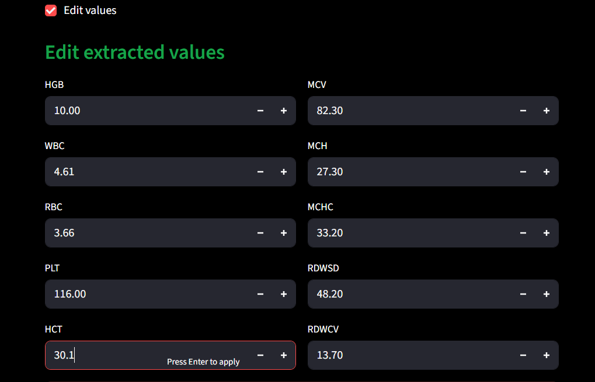
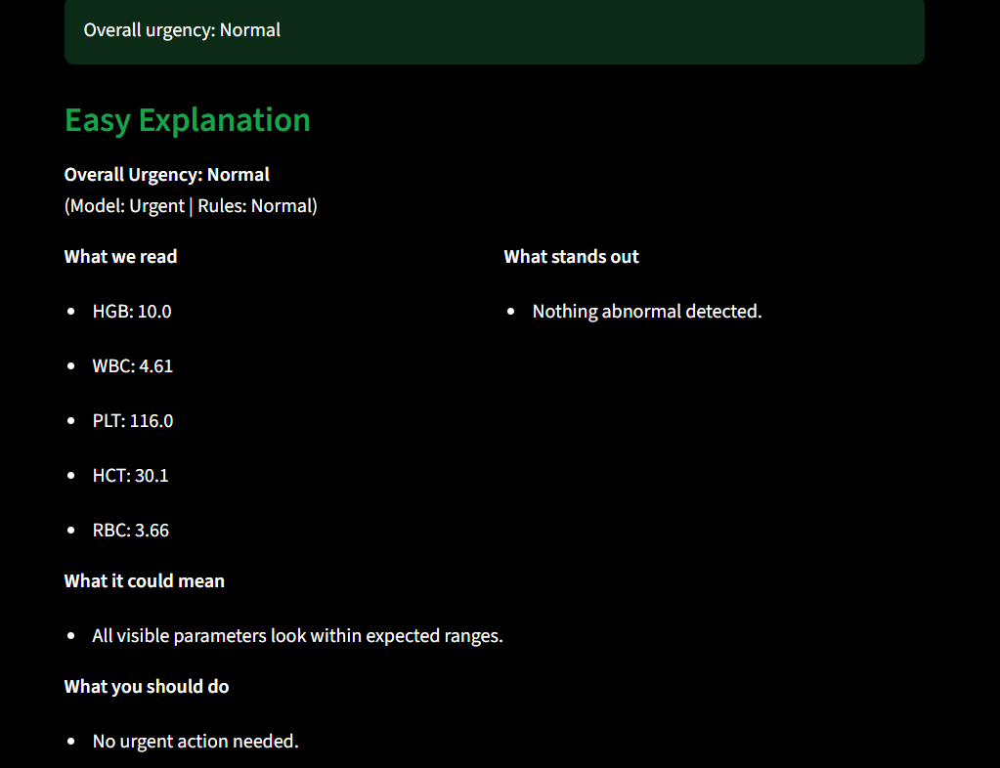
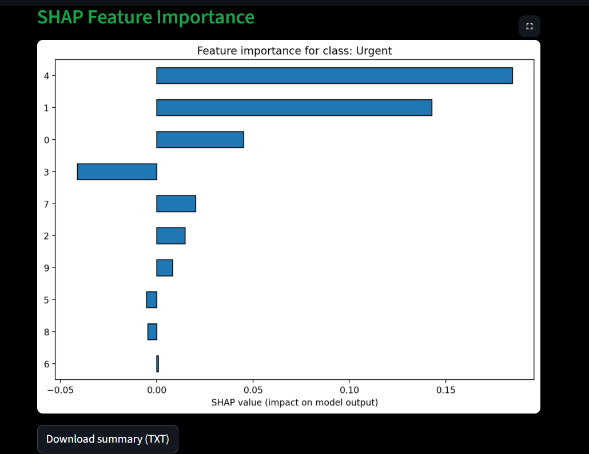

# CBC Report Interpreter using Explainable AI

An OCR-powered, ML-assisted diagnostic helper for **CBC (Complete Blood Count)** reports.
This Streamlit web app reads CBC reports (image), extracts values with advanced OCR, allows user corrections, predicts urgency using a hybrid ML + rule engine, and explains decisions with SHAP.

---

## 🚀 Features

### ✅ OCR Extraction (Highly Robust)

* Uses **Tesseract OCR + OpenCV preprocessing** for high-accuracy extraction
* Handles noisy scans, low DPI images, hyphens, separators, and malformed text
* Fuzzy-matches medical terms like “RDW-CV”, “RAW CV”, “row cv”, “rdw cv”, etc.
* Smart numerical sanity checks (e.g., CV range 8–25, SD range 30–80)

### ✅ Editable Values (Double-Check Mechanism)

* After extraction, users can toggle **Edit Mode**
* Manually correct any value before analysis
* Ensures reliable predictions even if OCR misreads something

### ✅ Hybrid Urgency Classification

Your system uses two intelligent layers:

1. **Machine Learning Model** (RandomForestClassifier)

   * Predicts Normal / Mild / Urgent / Emergency
   * Uses 10 features:
     `HGB, WBC, RBC, PLT, HCT, MCV, MCH, MCHC, RDWSD, RDWCV`

2. **Medical Rule Engine**

   * Applies domain-based thresholds & weighted deviations
   * Computes severity scores
   * Overrides model when:

     * Model overreacts
     * Rules indicate normal or mild deviation

✅ Prevents false “Urgent” predictions
✅ Ensures safety-first interpretation

### ✅ SHAP Explainability

Each prediction comes with a SHAP bar plot:

* Shows which CBC values influenced the ML model
* Helps doctors and patients understand model reasoning

### ✅ PDF + Image Support

OCR works on:

* JPG
* PNG
* JPEG

---

## 🧠 How It Works

### 1. Upload CBC report

The app automatically:

* Reads text using Tesseract
* Preprocesses images (resize, denoise, sharpen, threshold)
* Extracts CBC values using fuzzy matching + regex + range logic

### 2. Edit (Optional)

A toggle appears:

```
[ ] Edit values
```

When enabled:

* Editable numeric fields appear
* User overrides flow
* Updated values fed to ML + rules

### 3. Classification

* ML predicts urgency
* Rules evaluate deviation from normal ranges
* Final decision is combined for safety

### 4. Results

You get:

* ✅ Overall urgency
* ✅ What stands out
* ✅ What it could mean
* ✅ What you should do
* ✅ SHAP feature impact
* ✅ Downloadable TXT summary

---

## 📸 Screenshots

---

### 🔹 1. Home Page / Upload Screen


*Users upload CBC reports in JPG/PNG/JPEG formats.*

---

### 🔹 2. Extracted Values (OCR Output)


*Automatically detected CBC readings with an option to edit.*

---

### 🔹 3. Edit Mode (Manual Correction)


*Users can correct misread values before analysis.*

---

### 🔹 4. Final Urgency Result


*Combined ML + medical rule-based urgency classification.*

---

### 🔹 5. SHAP Explainability Plot & Downloadable Summary Report Option


*Visual explanation showing feature importance in model decision and Text-based summary including findings and recommendations.*

---

## 🛠️ Installation

### 1. Clone repo

```bash
git clone https://github.com/antarades/XAI_medical_CBC_report_interpreter.git
cd cbc-urgency-detector
```

### 2. Create virtual environment

```bash
python -m venv .venv
source .venv/bin/activate          # macOS/Linux
.venv\Scripts\activate             # Windows
```

### 3. Install requirements

```bash
pip install -r requirements.txt
```

### 4. Install Tesseract

Download from:
[https://github.com/tesseract-ocr/tesseract](https://github.com/tesseract-ocr/tesseract)

Update path inside `extractor.py`:

```python
pytesseract.pytesseract.tesseract_cmd = r"C:/Program Files/Tesseract-OCR/tesseract.exe"
```

---

## ▶️ Running the App

```bash
streamlit run app.py
```

---

## 📂 Project Structure

```
project/
│
├── app.py                     # Streamlit UI
├── extractor.py               # OCR + line parsing + fuzzy RDW logic
├── file_predict.py            # Rules, normalization, final decision logic
├── explain_cbc_model.py       # SHAP visualizer script
├── cbc_model.pkl              # Trained RandomForest model
├── label_encoder.pkl          # Label encoder for urgency classes
└── requirements.txt  
```

---

## 🧪 Machine Learning Model

### Model

* RandomForestClassifier
* Trained on labeled CBC dataset (`Normal`, `Mild`, `Urgent`, `Emergency`)

### Features

```
HGB, WBC, RBC, PLT, HCT, MCV, MCH, MCHC, RDWSD, RDWCV
```

### Safeguards

* Missing RDW values from old model version handled automatically
* Rules override unsafe ML predictions

---

## ⚠️ Limitations

* OCR accuracy depends on scan clarity
* Model should be retrained periodically with better and larger datasets
* Does not replace medical diagnosis; provides guidance only

---

## ✅ Future Enhancements

* Vision transformer for OCR
* Support PDF file format
* Fine-tuned lightweight model for structured table extraction
* Multi-report batch processing
* Confidence scoring
* Doctor view & patient view modes

---

## 📝 License

MIT License.
---
